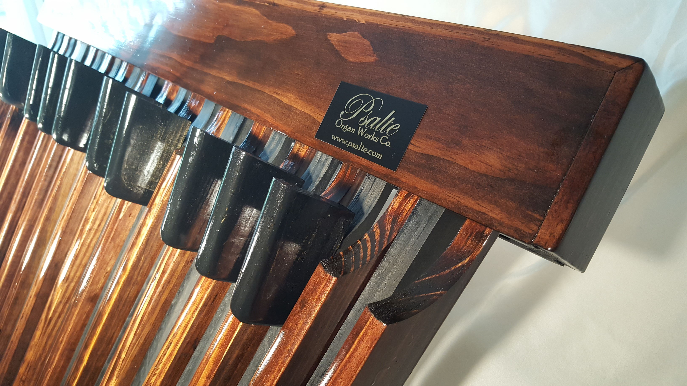
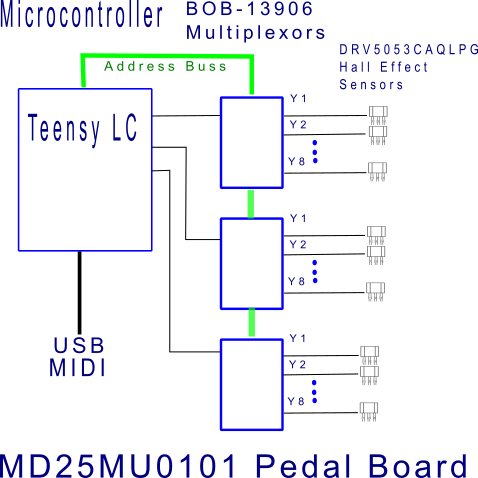

# MD25MU0101 Pedalboard
The MD25MU0101 is a 25 Pedal, MIDI/USB, Pedalboard. **See [Psalte.com](http://www.psalte.com)**

The pedalboard is intended for use with organ sample virtual instrument software (open source or commercial licensed), MIDI compliant keyboard/synthesizers/tone generators, and computer software such as sequencers and DAWs.

It's design utilizes an Arduino Teensy LC Micro-controller, 3 ea. 8 channel multiplexors and 25 Hall effect sensors.

The microcontroller code as well as a complete test suite are included in the repository.

Example binary MIDI data files for each command edge/test case are included in the 'MIDI Commands' folder. Also included is an example Bash script file that sends the MIDI commands in each file to a MIDI channel using software common to a typical Linux distribution.



The MD25MU0101's many parameters are settable using MIDI utility software for Windows or Linux. 
Settings include:

* MIDI Channel
* USB/MIDI cable
* Pedal Sensitivity
* Pedal Velocity
* Transposition Interval.

These parameters are all configurable via MIDI System Exclusive commands. Any device or software
that can send specific/custom MIDI System Exclusive commands can be used to set these parameters. Below are listed the MIDI
commands, descriptions and the specific hexadecimal values that comprise them. (default parameter values shown)

**F0 7E 1E 01 01 F7** Set Channel. Set the MIDI Channel
Default = 1

**F0 7E 1E 02 00 F7** Set Velocity flag

* False = Send a constant fixed MIDI velocity value (default).
* True = Send a dynamic MIDI velocity value depending on velocity of the pedal as played.

**F0 7E 1E 03 00 F7** Set Virtual USB Cable. The Virtual USB Cable is used for USB MIDI only. Default is 0.

**F0 7E 1E 04 00 F7** Set Sensitivity. This sets the point at which depressing the pedal
causes the note to be played. Allowed range is 0 to 25. Default is 0 which sets the required pedal
distance of travel at a maximum.

**F0 7E 1E 05 24 F7** Set Transpose. Default value is 36 which makes the leftmost pedal
C2. Range is 0 (transpose down 36 half steps) to
102. The number represents the MIDI note number
to be used for the first (leftmost) pedal.

**F0 7E 1E 11 00 F7** Reset. Reset all configurable parameters to default values. 

**F0 7E 1E 10 00 F7** Dump Status. This causes the pedalboard to send a specific MIDI
System Exclusive message containing the values of
all the configurable parameters.

**Identity Request:** The pedalboard responds to the MIDI standard broadcast (SysEx) message for requesting device identification.
Any equipment that receives the message should send a message in response that identifies that equipment. The pedalboard will identify itself and well as send current values of all parameters as follows:

```C++
0xF0 SysEx
0x7E Non-Realtime
0x7F The SysEx channel
0x1E Psalte Organ Works Co. Mfg. ID
0x01 Current Channel
0x00 Current Velocity flag
0x00 Current Cable
0x00 Current Sensitivity
0x24 Current Transpose
0xF7 End of SysEx
```